# Git是世界上最先进的分布式版本控制系统
# 一、Git和Github
## 1.两者区别
Git 是一个分布式版本控制系统，简单的说其实就是一个软件，用于记录一个或若干个文件内容变化，以便将来查阅特定版本呢修订情况的软件。  
Github (https://www.github.com) 是一个为用户提供 Git 服务的网站，简单说就是一个可以放代码的地方（不过可以放的当然不仅是代码）。Github除了提提供管理 Git 的 web 界面外，还提供了订阅、关注、讨论组、在线编辑器等丰富的功能，Gitgub 被称之为全球最大的基友网站  
## 2.Github注册
打开 Github 官网：https://github.com/ ，点击右上角的 “Sign up” 按钮。  
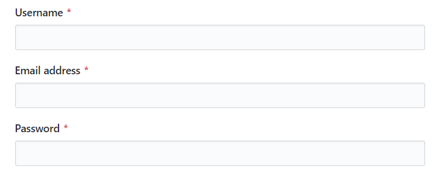  
选择免费账户类型：  
  
验证邮箱：  
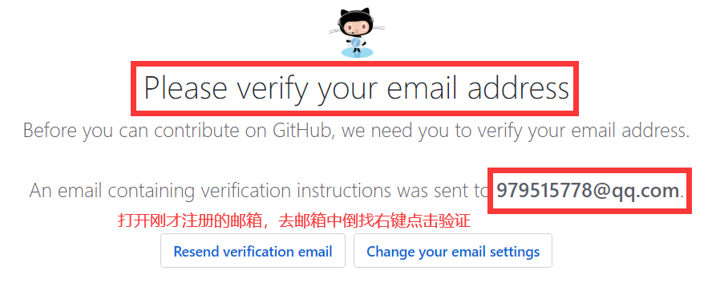  
进行验证：  
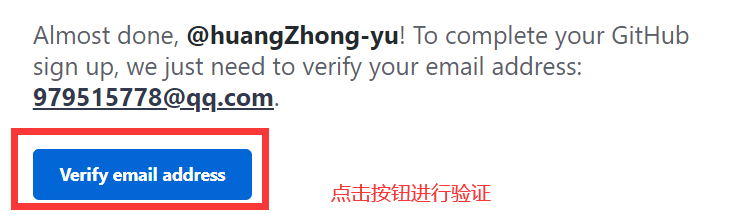  
## 3.Git安装
1.下载得到安装包，并运行  
  
2.选择安装位置，安装位置尽量不要有中文  
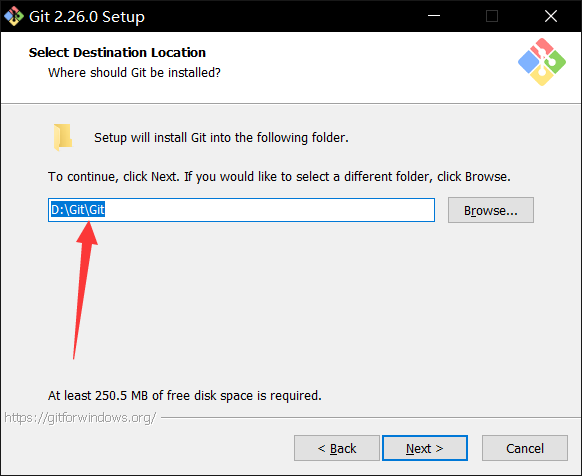  
3.选择需要安装的组件（默认即可，直接下一步）  
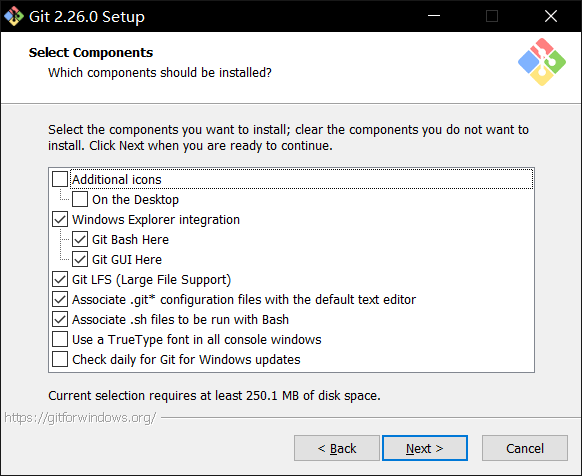  
4.选择使用的编辑器（默认即可，直接下一步）  
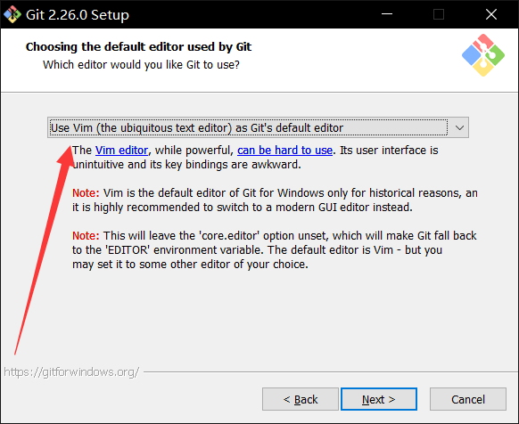  
5.一直下一步，直至安装完成即可。在最后一步取消view选框  
# 二、Git的使用
## 1.本地仓库
### 1.1工作流程
Git本地操作的三个区域：  
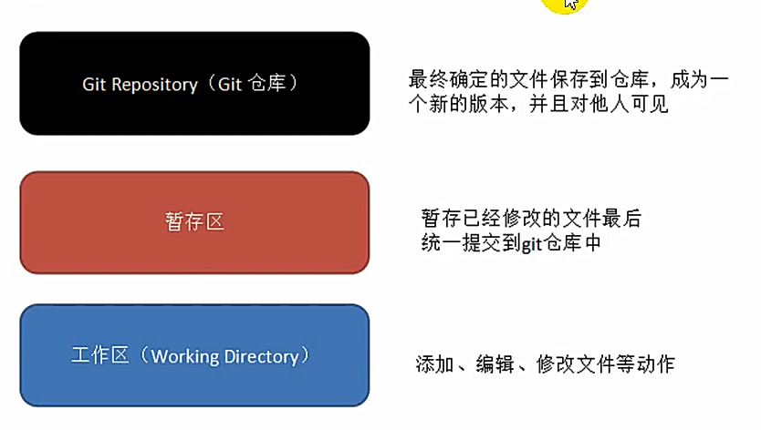  
工作流程：  
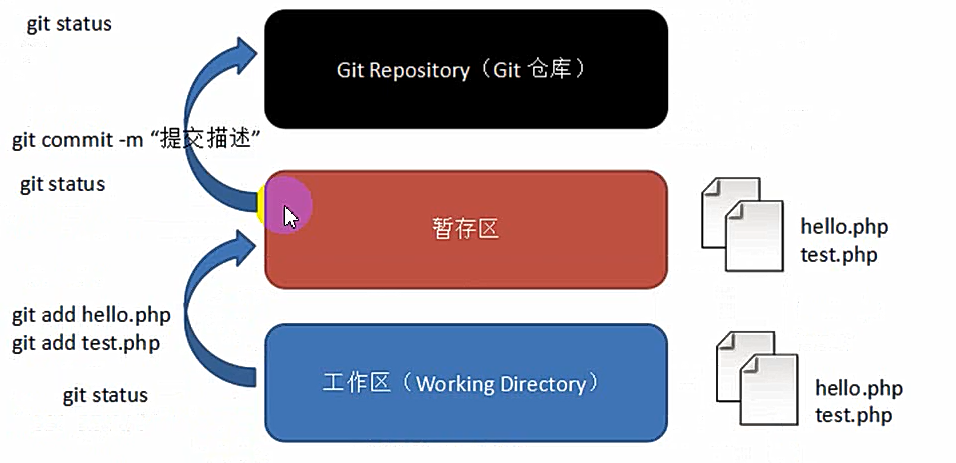  
### 1.2本地仓库操作
什么是仓库？仓库又名版本库，英文名 repository，我们可以简单理解成是一个目录，用于存放代码的，这个目录里面的所有文件都可以被 Git 管理起来，每个文件的修改、删除等操作 Git 都能跟踪到。  
1. 在安装好后首次使用需要先及进行全局配置  
桌面空白处右键，点击 “Git Bash Here“ 以打开 Git 命令行窗口  
```git
$git config --global user.name "用户名"
$git config --global user.email "邮箱地址"
```
2. 创建仓库  
当我们需要让 Git 去管理某个新项目/已存在项目的时候，就需要创建仓库了。注意：创建仓库时使用的目录不一定要求是空目录，选择一个非空目录也是可以的，但是不建议在现有项目上来学习 Git，否则造成的一切后果概不负责  
注意：为了避免在学习或者使用的过程中出现各种奇葩问题，请不要使用包含中文的目录名（父目录亦是如此）  
+ 创建空目录  
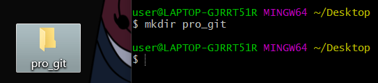  
+ 在命令行中进入项目目录pro_git  
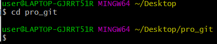  
+ Git初始化（让 Git 知道，它需要来管理这个项目）  
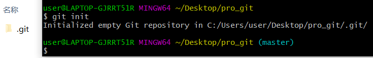  
**指令：git init**
表现：执行之后会在项目目录下创建 ”.git“ 的隐藏目录，这个目录是 Git 所创建的，不能删除，页不能随意更改其中的内容  
3. Git 常用指令操作  
查看当前状态：git status  
添加到缓存区：git add 文件名  
说明：git add 指令，可以添加一个文件，也可以同时添加多个文件  
```git
语法1：git add 文件名
语法2：git add 文件名1 文件名2 文件名3......
语法3：git add .      // 添加当前目录到缓存区中
```
提交至版本库：**git commit -m "注释内容"**  
后续对于文件（可以操作1个或多个）操作之后，重复使用 git add 与 git commit 指令即可。  
### 1.3时光穿梭机---版本回退
版本回退分为两步骤进行操作：  
步骤：  
1. 查看版本  
   + 指令
      + git log
      + git log --pretty=oneline  
2. 回退操作
   + 指令
      + git reset --hard 提交编号（就是 commit 的 id）  
案例：坐时光机回到创建好的第一个文件 readme.txt 的时候。  
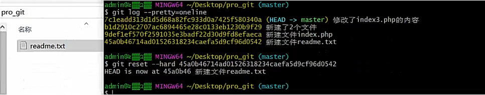  
注意：回到过去之后，要想再回到之前最新的版本的时候，则需要使用指令去查看历史操作以得到最新的 commit id。  
指令：`git reflog`  
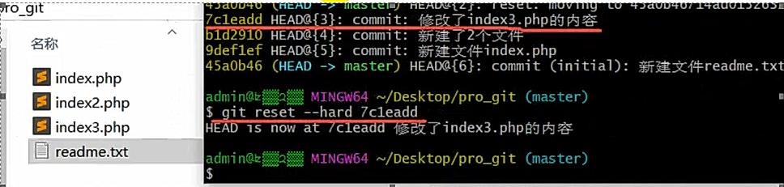  

小结：  
+ 要想回到过去，必须先得到 commit id，然后通过 git reset --hard 进行回退  
+ 要想回到未来，需要使用 git reflog 进行历史操作查看，得到最新的 commit id。  
+ 在写回退指令的时候 commit id 可以不用写全，git 会自动识别，但是也不能写太少，至少需要写前 4 位字符。 

# 三、Github远程仓库创建
## 1.创建仓库
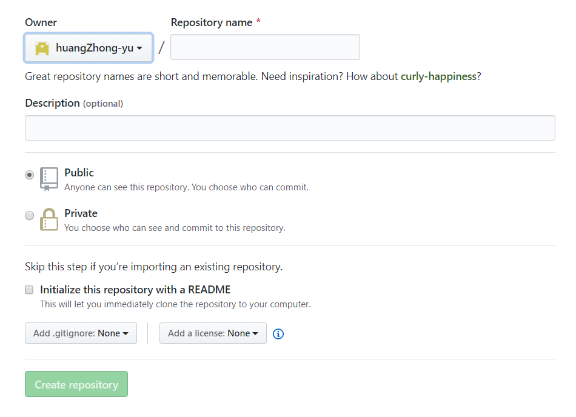  
**注意：仓库名在当前账号下是唯一的**  
## 2.两种常规使用方式
### 2.1 基于http协议
1. 创建空目录，名称就为 code_one
  
2. 使用 clone 指令克隆线上地址到本地  
语法：`git clone 线上仓库地址`  
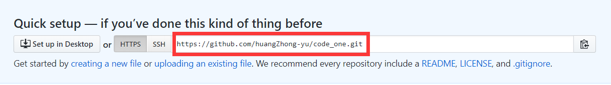  
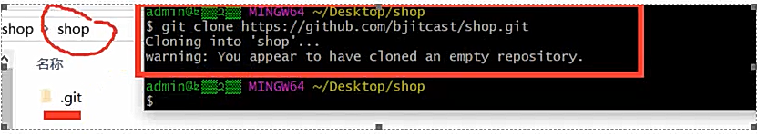  
3. 在仓库上做对应的操作（提交缓存区、提交本地仓库、提交线上仓库、拉取线上仓库）  
提交到线上仓库的指令：`git push`  
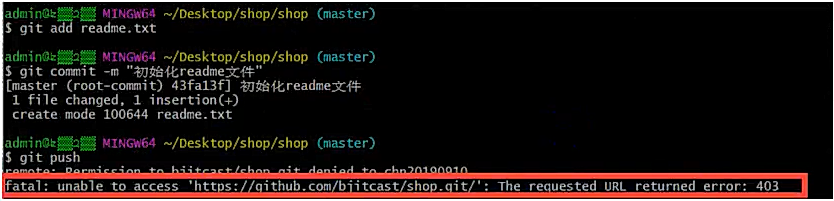  
在首次往线上仓库 shop 提交内容的时候出现了 403 的致命错误，原因是不是任何人都可以往线上仓库提交内容，必须有权限。  
需要修改 “.git/config” 文件内容：  
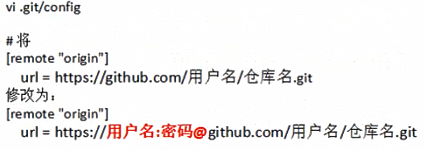  
例如：  
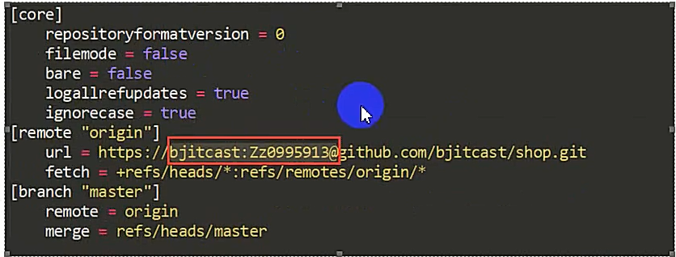  
在设置好用户名密码之后再次尝试 push指令：  
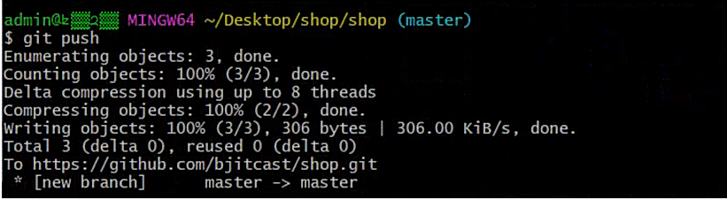  
如果看到类似上述效果（没有 fatal 错误），则表示提交成功。  
【验证】此时可以观察浏览器，刷新线上仓库的地址：  
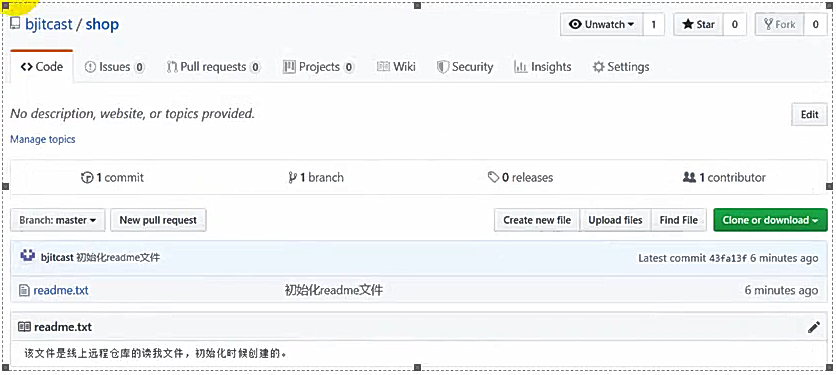  
拉取线上仓库：`git pull`  
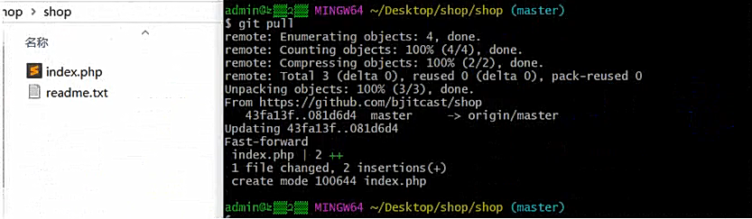  
提醒：  
**在每天工作的第一件事就是先 git pull 拉取线上最新的版本；**  
**每天下班前要做的是 git push，将本地代码提交到线上仓库；**  
### 2.2基于 ssh 协议（推荐）
**该方式与前面的 https 方式相比，只是影响 github 对于用户的身份鉴权方式，对于 git 的具体操作(如提交本地、添加注释、提交远程等操作)没有任何影响。**  
生成公钥对指令（需先自行安装 OpenSSH）：ssh-keygen -t rsa -C "注册邮箱"  
步骤：  
   1. 生成客户端公私钥文件  
   2. 将公钥上传Github   -->
实际操作：  
   1. 打开提示  
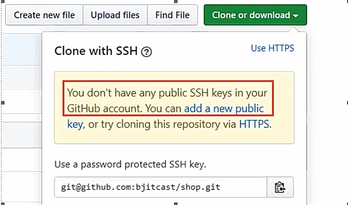  
   2. 创建公私钥对文件  
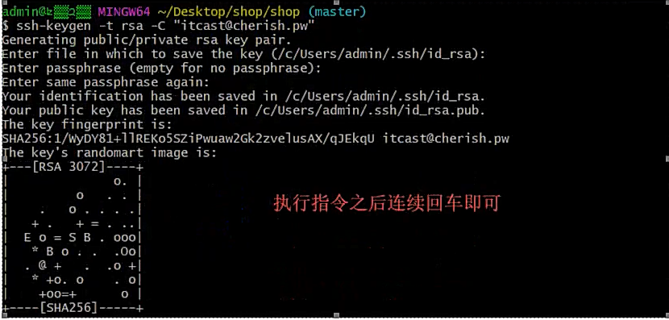  
   3. 上传公钥文件内容（id_rsa.pub）  
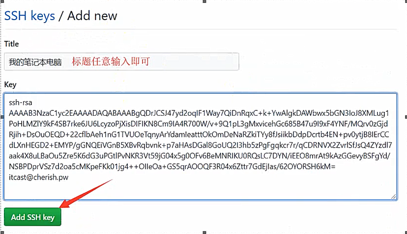  
填写完毕之后保存即可。  
   4. 执行后续 git 操作与先前一样  
      + clone 线上仓库到本地（git clone）  
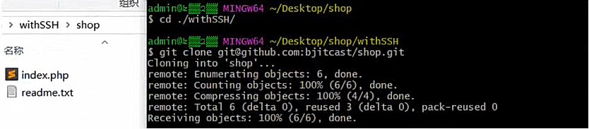  
      + 修改文件后添加缓存区  
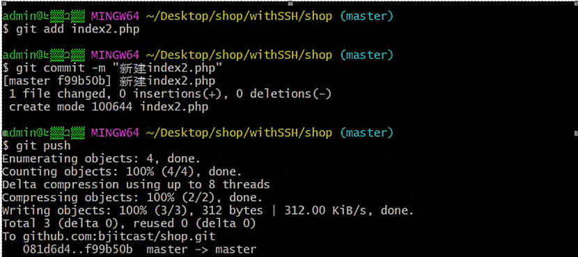  
线上仓库的效果：  
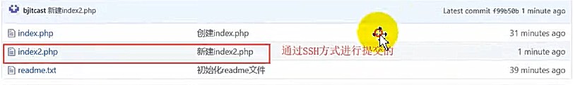  
### 2.3分支
什么是分支？  
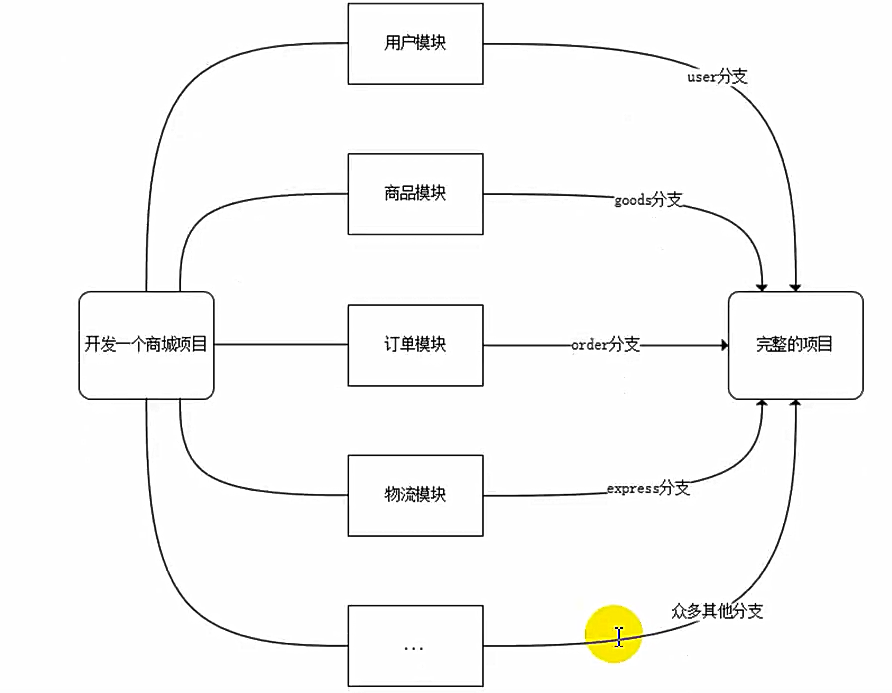  
在版本回退的章节里，每次提交后do都会有记录，Git把他们串成时间线，形成类似于时间轴的东西，这个时间轴就是一个分支，w我们称之为 **master 分支**。  
在开发的时候w往往是团队协作，多人进行开发，因此光有一个分支是无法满足多人同时开发的需求的，并且在分支上工作并不影响其他分支的正常工作，会更加安全，Git鼓励开发者使用分支去完成一些开发任务。  
分支相关指令：  
+ 查看分支：git branch  
+ 创建分支：git branch 分支名  
+ 切换分支：git checkout 分支名  
   + 对于新分支，可以使用 "git checkout -b 分支名" 指令来切换分支，-b 选项表示创建并切换，相当于是两个操作指令  
+ 删除分支：git branch -d 分支名  
+ 合并分支：git merge 被合并的分支名  
#### 查看分支：
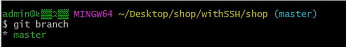  
注意：当前分支前面有个标记 “*”  
#### 创建分支：
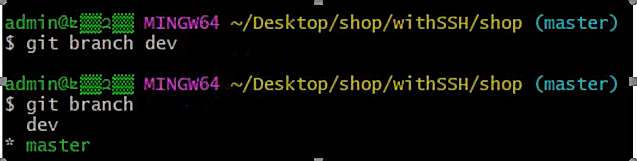  
#### 切换分支：
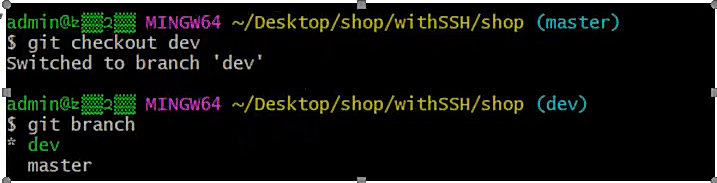  
#### 合并分支：
现在先在dev分支下的 readme 文件中新增一行并提交本地  
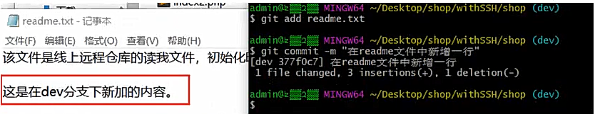  
切换到 master 分支下观察 readme 文件  
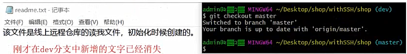  
 将dev分支的内容与 master 分支合并：  
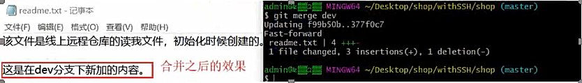  
#### 删除分支：
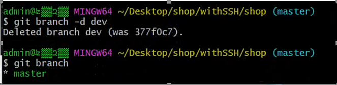  
**注意：在删除分支的时候，一定要先退出要删除的分支**  
合并所有分支之后，需要将 master 分支提交到线上远程仓库中：  
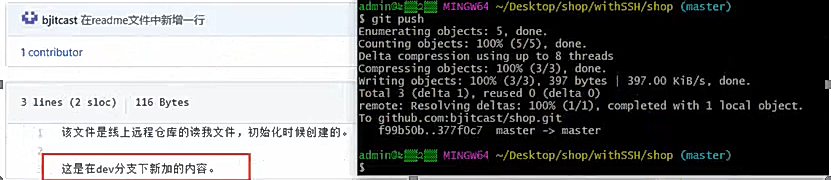  
### 2.4冲突的产生与解决
案例：模拟冲突产生  
1. 同事在下班之后修改了线上仓库的代码  
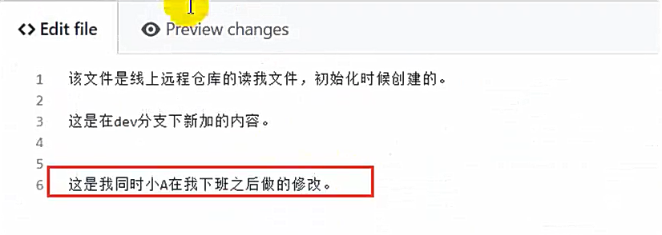  
注意：此时本地仓库的内容和线上的不一致  
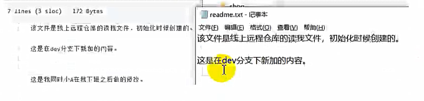  
2. 第二天上班的时候，我没有做 git pull 操作，而是直接修改了本地的对应文件的内容  
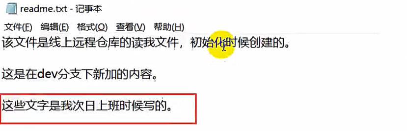  
3. 需要在下班的时候将代码修改提交到线上仓库（git push）  
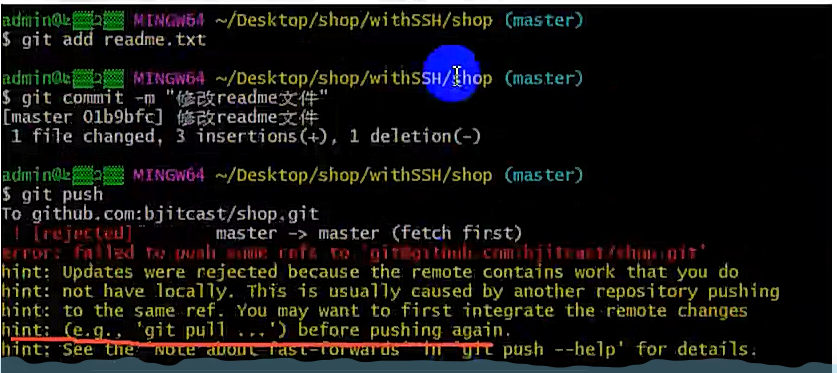  
提示我们要在再此 git push 之前先 git pull 操作；  
#### 解决冲突
4. 先 git push  
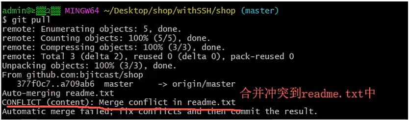  
此时 git 已经将线上与本地仓库的冲突合并到了对应的文件中。  
5. 打开冲突文件，解决冲突  
解决方法：需要和同事（谁先提交的）进行商量，看代码如何保留，将改好的文件再次提交即可。  
# 四、Git使用技能
## 1.图形化管理工具
### 1.1Github for Desktop
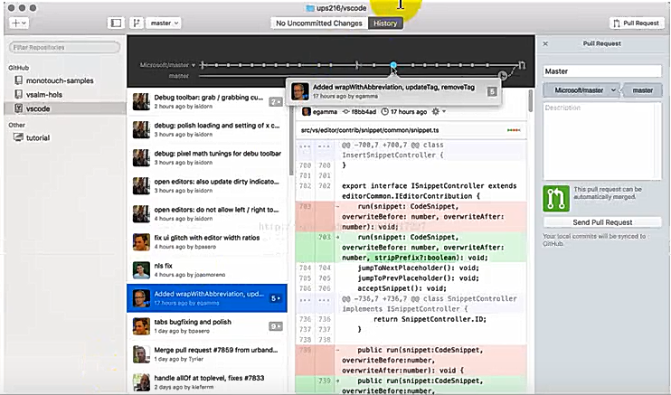  
Github 出品的软件，功能完善，使用方便，对于经常使用 Github 的开发人员来说是非常便捷的工具，界面干净，用起来非常的顺手，顶部的分支时间线非常绚丽。  
### 1.2Source tree
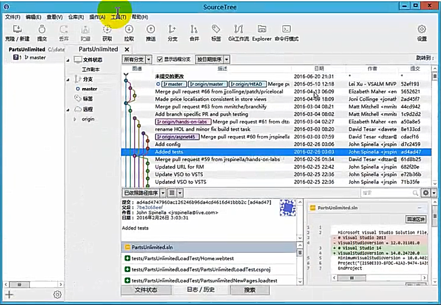  
老牌的 Git GUI 管理工具，也号称是最好用的 Git GUI 工具，功能丰富，基本操作和高级都非常的流畅，适合初学者上手。  
### 1.3TortoiseGit
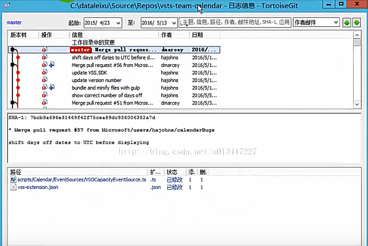  
对于熟悉 SVN 的开发人员来说，这个小乌龟图标应该是非常的友善了，TortoiseGit 简称 tgit 中文名海龟 Git，它与其前辈 TortoiseSVN 都是非常优秀的开源版本控制客户端软件。  
## 2.忽略文件
场景：在项目目录下有很多万年不变的文件目录，例如：css、js、images等，或者还有一些目录即便有改动，我们也不想让其提交到远程仓库的文档，此时我们可以使用 ”忽略文件“ 机制来实现需求。  
忽略文件需要新建一个名为 ”**.gitignore**“ 的文件，该文件用于声明忽略文件或不忽略文件的规则，**规则对当前目录及其子目录生效**。  
**注意：该文件因为没有文件名，没有办法直接在 windows 目录下直接创建，可以通过命令行 Git Bash 来 touch 创建。**  
常见规则写法如下几种：  
```html
/mtk/ // 过滤整个文件夹
*.zip // 过滤所有 .zip 文件
/mtk.do.c // 过滤某个具体的文件
!index.html // 不过滤具体某个文件
```  
**命令行创建 .gitignore 文件**  
  
通过 **touch .gitignore** 创建  
# 五、提交项目到码云托管
这种方式可以直接将项目托管到GitHub上，不需要克隆复制。  
1. **使用 git remote add origin github地址**  
2. **使用 git push -u origin master**  
用（传统方式）命令行把修改过后的代码上传到码云？  
1. git add .  
2. git commit -m "提交信息"  
3. git push  